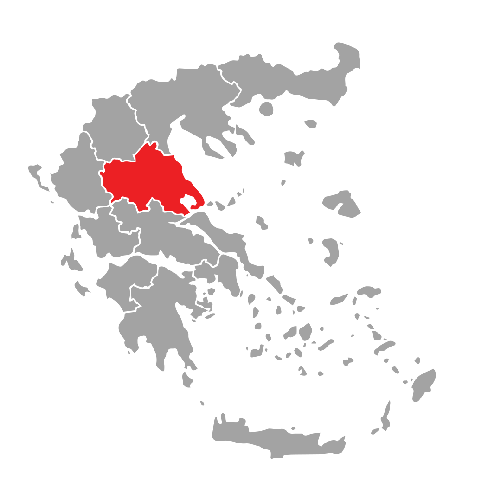

# Volunteer Coordination Platform  
## Programming & Systems on the World Wide Web  
### Academic Lab Exercise - 2023/2024  
#### Subject: Volunteer Coordination Platform during Natural Disasters  
#### Version 1.0 – 03/11/2023

---

## Overview

This web application is developed as a collaborative system for registering urgent help requests and managing community needs following natural disasters. Its modular design supports three distinct user roles, each with specific functionalities to ensure the efficient coordination of supplies and resources during an emergency:

- **Citizens** submit urgent requests for essential supplies and also indicate availability of surplus items.
- **Rescuers** use dedicated vehicles to collect or deliver these items based on proximity and demand.
- **Administrators (Base)** manage the inventory, update product categories, monitor ongoing tasks, and maintain the overall system through an intuitive mapping interface.

---

## Project Structure

The application is organized into several modules and components:

- **Administrator Module:**  
  - **User Authentication:** Secure login and logout for administrators.
  - **Inventory Management:** Creation, modification, and real-time updating of product categories and supplies through forms and JSON uploads.
  - **Mapping Interface:** Displays the base, vehicle positions, and tasks (requests/offers) on an interactive map with filters for specific data points.
  - **Reporting & Statistics:** Provides real-time charts and graphs (via Chart.js) that depict key performance indicators such as new submissions, completed deliveries, and current inventory levels.
  - **Account Management:** Ability to create accounts for rescuers to facilitate task coordination.

- **Rescuer Module:**  
  - **Geolocation & Proximity Detection:** Rescuers’ vehicles have geolocation integration to ensure tasks are only completed when within a specified distance (between 50 and 100 meters) from the target location.
  - **Task Management:** Displays a list of active tasks on the map, allows rescuers to claim tasks, and shows task details including citizen information and item requests.
  - **Vehicle Load Management:** Rescuers manage their vehicle’s load—loading items when near the base and unloading on task completion—with automatic updates to the inventory.

- **Citizen Module:**  
  - **Account Registration & Login:** Secure authentication and account management including personal, contact, and geolocation details.
  - **Request/Offer Submission:** Citizens can create multiple product requests and offers using an intuitive form interface with search and auto-complete features to help select the correct product category.
  - **History & Notifications:** Displays a detailed history of submitted requests and offers along with live updates on the status of each submission. Notifications inform citizens when an offer has been claimed or when a request is ready for delivery.

- **Database Module:**  
  - **Schema & Relationships:** The database stores relationships among users, inventory items, requests/offers, and tasks. It includes constraints and relationships to ensure data integrity.
  - **Stored Procedures & Triggers:** Automated procedures handle data consistency when tasks are claimed or marked as completed. E.g., triggers ensure that inventory levels are adjusted automatically during task processing.
  - **Data Imports:** The system supports importing product data from JSON files and shared repositories, ensuring that product catalogs are consistently updated.

- **Mapping & Visualization:**  
  - **Interactive Map:** Utilizes mapping APIs to render the base, citizen request locations, rescuer vehicle positions, and task markers.
  - **Marker Customization:** Different marker colors and icons are used to distinguish between requests, offers, active tasks, and completed tasks.
  - **Filters & Layers:** Users can apply filters (toggle view options) on the map to isolate markers based on their status or type.

---

## Detailed Functionality

### 1. User Authentication & Account Management

- **Login/Logout:**  
  Ensures that only authorized users can access the system. Unauthorized access is redirected to the login page.  
- **Account Creation:**  
  Administrators create accounts for rescuers, while citizens register through the public interface. Registration includes geolocation data for accurate mapping.

### 2. Inventory & Product Management

- **Product Catalog:**  
  Administrators maintain a catalog of products including essential supplies such as water, food, medical supplies, and more.  
- **Data Import & Integration:**  
  Supports initialization and ongoing updates from external JSON repositories, ensuring the product catalog is current.  
- **Real-Time Adjustments:**  
  Inventory levels are updated dynamically based on tasks completed by rescuers, which either deduct or add quantities based on the type of transaction (loading or unloading).

### 3. Task Coordination & Management

- **Task Submission:**  
  Citizens submit requests or offers with details such as item type, quantity, and the number of people affected. Each submission generates an individual task.
- **Task Assignment:**  
  Rescuers have a dynamic list of tasks that they can accept. The system verifies proximity and vehicle load before allowing a task to be claimed.
- **Completion & Cancellation:**  
  Rescuers can mark tasks as "completed," automatically updating the system inventory, or "cancel" tasks so that they can be picked up by other rescuers.

### 4. Mapping & Real-Time Visualizations

- **Interactive Map:**  
  Displays all key entities with customized markers and allows for "click and drag" repositioning of both the base and vehicles.  
- **Live Data Overlays:**  
  Information about task status (active, completed, pending) is visually represented on the map for rapid decision-making.  
- **Filter & Search Options:**  
  Users can filter the map view to display specific types of markers (e.g., pending offers, active requests) to reduce clutter and focus on specific areas of interest.

### 5. Reporting & Analytics

- **Real-Time Dashboard:**  
  Administrators can access dashboards that showcase charts and graphs representing the overall performance of task management including new submissions, task completions, and current inventory levels.  
- **Historical Data Analysis:**  
  The system stores historical data to permit analysis over configurable time intervals, helping evaluate the efficiency and responsiveness of the rescue operations.

---

## Database Overview

- **SQL Dump:**  
  The file [`Dump20240916.sql`](Final Web Project/DB_Exported/Dump20240916.sql) contains the exported schema and data, including necessary commands to disable/enable foreign key checks and set the proper SQL modes.
  
- **JSON Data:**  
  JSON files like [`test.json`](Final Web Project/kata-strofi/MySQL DB/test.json) include extensive lists of product categories used to initialize and update the inventory.

- **Entity Relationship Diagram (ERD):**  
  The ERD diagram outlining the relationships between tables and entities in the database can be found here:

---

## Getting Started

1. **Server Configuration:**  
   Install and run a PHP/MySQL server using XAMPP. Ensure the project is located under `c:\xampp\htdocs\offlineVER`.

2. **Database Setup:**  
   Import the SQL dump from [`Dump20240916.sql`](Final Web Project/DB_Exported/Dump20240916.sql) along with any additional scripts (procedures and triggers).  
   Verify your connection settings in `db_config.php`.

3. **Initializing Inventory:**  
   Use the provided JSON files (e.g., [`test.json`](Final Web Project/kata-strofi/MySQL DB/test.json)) to import the product catalog and update inventory details.

4. **Launching the Application:**  
   Open the administrator interface (`admin.html`) or use the corresponding citizen and rescuer interfaces to start interacting with the system.

---

## Authors

- [OrestisMakris](https://github.com/OrestisMakris)
- [AxillV](https://github.com/AxillV)
- [NickMavrias](https://github.com/NickMavrias)

---

## License

This project is licensed under the MIT License. See the [LICENSE](LICENSE) file for details.

---

## Conclusion

This platform offers a comprehensive, modular solution for managing urgent requests and coordinating volunteer efforts during natural disasters. Its advanced features – ranging from secure user authentication and dynamic inventory management to real-time mapping and task coordination – ensure that emergency supplies are distributed efficiently and that all stakeholders have access to up-to-date information.